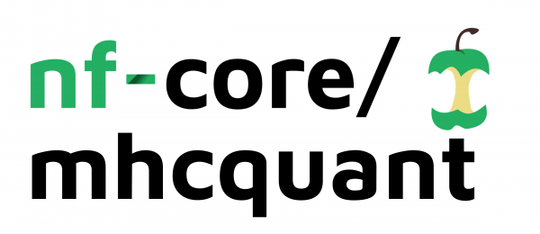

# 

**Identify and quantify peptides from mass spectrometry raw data**.

[](https://travis-ci.com/nf-core/mhcquant)
[](https://github.com/nf-core/mhcquant/actions)
[](https://github.com/nf-core/mhcquant/actions)
[](https://www.nextflow.io/)
[](http://bioconda.github.io/)
[](https://hub.docker.com/r/nfcore/mhcquant)

## Introduction

nfcore/mhcquant is a bioinformatics analysis pipeline used for quantitative processing of data dependent (DDA) peptidomics data.

It was specifically designed to analyse immunopeptidomics data, which deals with the analysis of affinity purified, unspecifically cleaved peptides that have recently been discussed intensively in [the context of cancer vaccines](https://www.nature.com/articles/ncomms13404).

The workflow is based on the OpenMS C++ framework for computational mass spectrometry. RAW files (mzML) serve as inputs and a database search (Comet) is performed based on a given input protein database. FDR rescoring is applied using Percolator 3.0 based on a competitive target-decoy approach (reversed decoys). For label free quantification all input files undergo identification based retention time alignment (MapAlignerIdentification), and targeted feature extraction matching ids between runs (FeatureFinderIdentification). In addition, a variant calling file (vcf) can be specified to translate variants into proteins that will be included in the database search and binding predictions on specified alleles (alleles.tsv) using MHCFlurry (Class 1) or MHCNugget (Class 2) can be directly run on the output peptide lists. Moreover, if a vcf file was specified, neoepitopes will automatically be determined and binding predictions can also directly be predicted for them.

The pipeline is built using [Nextflow](https://www.nextflow.io), a workflow tool to run tasks across multiple compute infrastructures in a very portable manner. It comes with docker containers making installation trivial and results highly reproducible.

## Quick Start

i. Install [`nextflow`](https://nf-co.re/usage/installation)

ii. Install one of [`docker`](https://docs.docker.com/engine/installation/), [`singularity`](https://www.sylabs.io/guides/3.0/user-guide/) or [`conda`](https://conda.io/miniconda.html)

iii. Download the pipeline and test it on a minimal dataset with a single command

```bash
nextflow run nf-core/mhcquant -profile test,<docker/singularity/conda/institute>
```

> Please check [nf-core/configs](https://github.com/nf-core/configs#documentation) to see if a custom config file to run nf-core pipelines already exists for your Institute. If so, you can simply use `-profile institute` in your command. This will enable either `docker` or `singularity` and set the appropriate execution settings for your local compute environment.

iv. Start running your own analysis!

```bash
nextflow run nf-core/mhcquant --mzmls '*.mzML' --fasta 'SWISSPROT_12_2018.fasta' --alleles 'alleles.tsv' --vcf 'variants.vcf' --include_proteins_from_vcf --predict_class_I --refine_fdr_on_predicted_subset -profile standard,docker
```

See [usage docs](docs/usage.md) for all of the available options when running the pipeline.

## Documentation

The nf-core/mhcquant pipeline comes with detailed documentation about the pipeline, found in the `docs/` directory:

1. [Installation](https://nf-co.re/usage/installation)
2. [Running the pipeline](docs/usage.md)
3. Pipeline HPC Cluster configuration
    * [Local installation](https://nf-co.re/usage/local_installation)
    * [Adding your own system config](https://nf-co.re/usage/adding_own_config)
4. [Output and how to interpret the results](docs/output.md)
5. [Troubleshooting](https://nf-co.re/usage/troubleshooting)
6. [Pipeline-specific Troubleshooting](docs/troubleshooting.md)

## Credits

nf-core/mhcquant was originally written by Leon Bichmann.

## Contributions and Support

If you would like to contribute to this pipeline, please see the [contributing guidelines](.github/CONTRIBUTING.md).

For further information or help, don't hesitate to get in touch on [Slack](https://nfcore.slack.com/channels/mhcquant) (you can join with [this invite](https://nf-co.re/join/slack)).

## Citation

You can cite the `nf-core` pre-print as follows:  

> Ewels PA, Peltzer A, Fillinger S, Alneberg JA, Patel H, Wilm A, Garcia MU, Di Tommaso P, Nahnsen S. **nf-core: Community curated bioinformatics pipelines**. *bioRxiv*. 2019. p. 610741. [doi: 10.1101/610741](https://www.biorxiv.org/content/10.1101/610741v1).
nf-core/mhcquant was originally written by [Leon Bichmann](https://github.com/Leon-Bichmann),[Lukas Heumos](https://github.com/zethson),[Alexander Peltzer](https://github.com/apeltzer)
